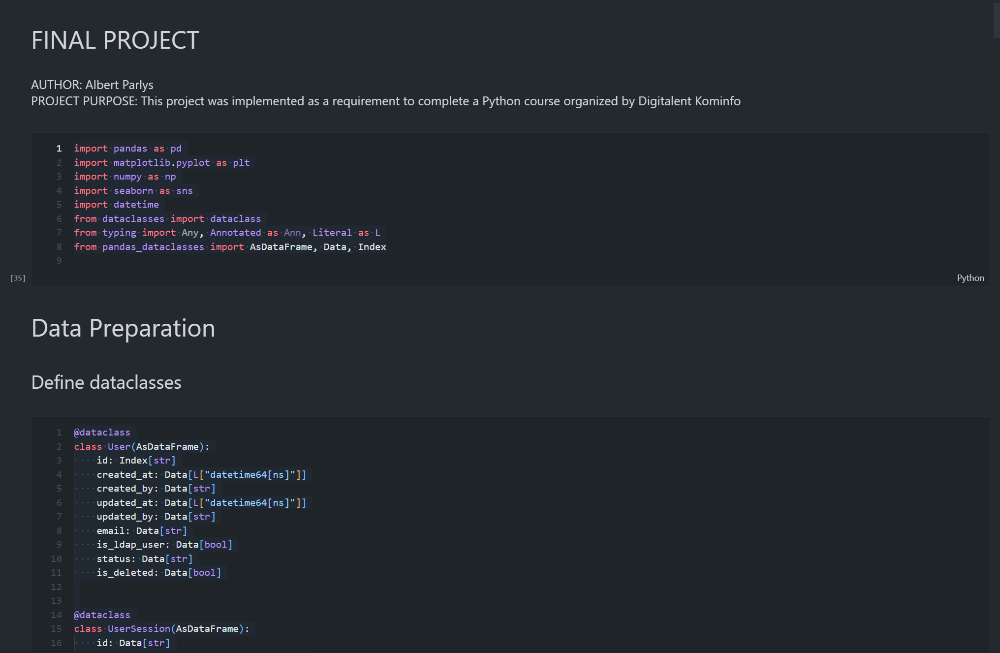
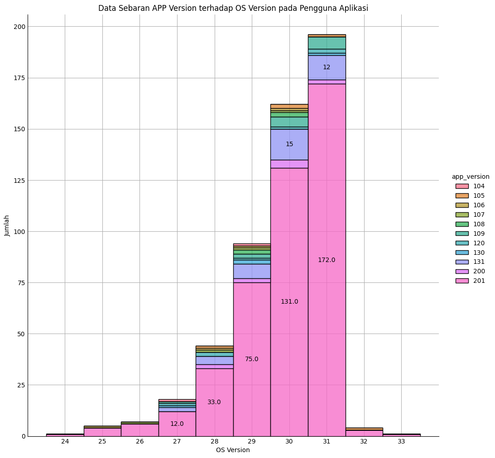

<h1 align="center">
  <a href="https://github.com/albertparlys/final-project-albert-parlys-pyt4-proa-dts-2022">
    <!-- Please provide path to your logo here -->
    
  </a>
</h1>

<div align="center">
  Final Project Python Albert Parlys PYT4 DTS 2022
  <br />
  <a href="#about"><strong>Explore the screenshots »</strong></a>
  <br />
  <br />
  <a href="https://github.com/albertparlys/final-project-albert-parlys-pyt4-proa-dts-2022/issues/new?assignees=&labels=bug&template=01_BUG_REPORT.md&title=bug%3A+">Report a Bug</a>
  ·
  <a href="https://github.com/albertparlys/final-project-albert-parlys-pyt4-proa-dts-2022/issues/new?assignees=&labels=enhancement&template=02_FEATURE_REQUEST.md&title=feat%3A+">Request a Feature</a>
  .<a href="https://github.com/albertparlys/final-project-albert-parlys-pyt4-proa-dts-2022/discussions">Ask a Question</a>
</div>

<div align="center">
<br />

[](LICENSE)

[](https://github.com/albertparlys/final-project-albert-parlys-pyt4-proa-dts-2022/issues?q=is%3Aissue+is%3Aopen+label%3A%22help+wanted%22)
[](https://github.com/albertparlys)

</div>

<details open="open">
<summary>Table of Contents</summary>

- [About](#about)
  - [Built With](#built-with)
- [Getting Started](#getting-started)
  - [Prerequisites](#prerequisites)
  - [Installation](#installation)
- [Usage](#usage)
- [Roadmap](#roadmap)
- [Support](#support)
- [Project assistance](#project-assistance)
- [Contributing](#contributing)
- [Authors & contributors](#authors--contributors)
- [Security](#security)
- [Acknowledgements](#acknowledgements)

</details>

---

## About

<table><tr><td>

> This project was implemented as a requirement to complete a Python course organized by Digitalent Kominfo.
> This project also try to support decision making in application deployment strategies by providing insight from users and session data.

<details>
<summary>Screenshots</summary>
<br>

|                               Data Preparation                               |                                Output                                |
| :--------------------------------------------------------------------------: | :------------------------------------------------------------------: |
|  |  |

</details>

</td></tr></table>

### Built With

> Python

## Getting Started

### Prerequisites

> python version 3.10

### Installation

clone this project

```
git clone https://github.com/albertparlys/final-project-albert-parlys-pyt4-proa-dts-2022.git
```

install depedencies

```
cd final-project-albert-parlys-pyt4-proa-dts-2022
pipenv install --requirements.txt
```

## Usage

```
python src/core/main.py
```

## Contributing

Please read [our contribution guidelines](docs/CONTRIBUTING.md), and thank you for being involved!

## Authors & contributors

The original setup of this repository is by [Albert Parlys](https://github.com/albertparlys).

For a full list of all authors and contributors, see [the contributors page](https://github.com/albertparlys/final-project-albert-parlys-pyt4-proa-dts-2022/contributors).

## Security

Final Project Python Albert Parlys PYT4 DTS 2022 follows good practices of security, but 100% security cannot be assured.
Final Project Python Albert Parlys PYT4 DTS 2022 is provided **"as is"** without any **warranty**. Use at your own risk.

_For more information and to report security issues, please refer to our [security documentation](docs/SECURITY.md)._

## Acknowledgements

- PROA DTS 2022, Kominfo
- Python
- Python Community
